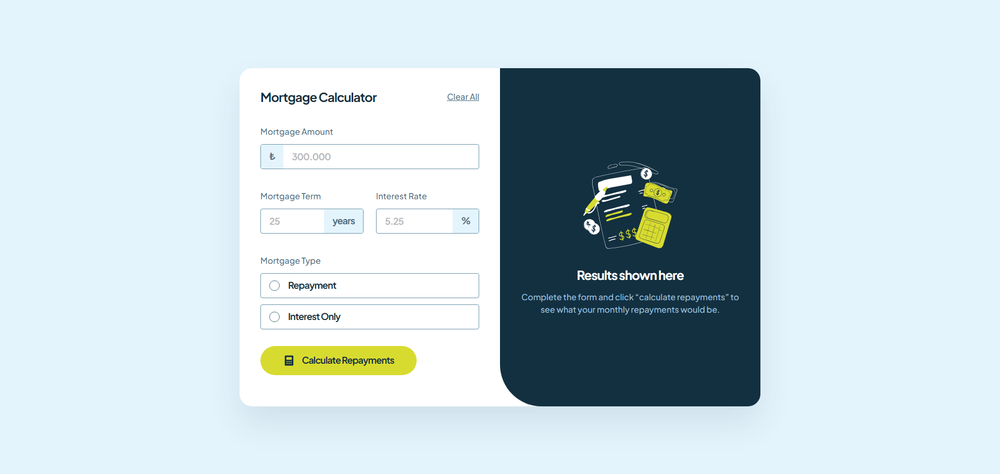
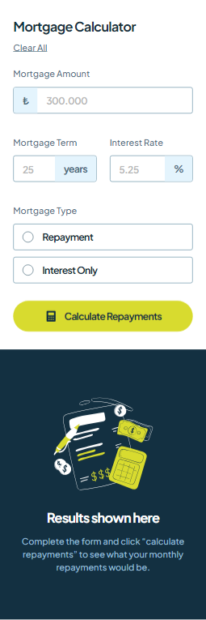

# Mortgage Calculator

A web application that calculates mortgage payments with flexible options.

## Screenshot

<b>Desktop Design</b>

  

<b>Tablet Design</b>

  

<b>Mobile Design</b>

  

## Live Demo

[Check out the live demo here:](https://mortgage-calculator-focuscode.vercel.app)

## Project Summary

- Flexible Mortgage Options: Users can choose between "interest-only" and "repayment" mortgage types.
- Enhanced User Experience: Includes animated transitions and displays both monthly and total payment amounts.
- Responsive Design: The project is fully responsive, ensuring optimal usability across all devices.
